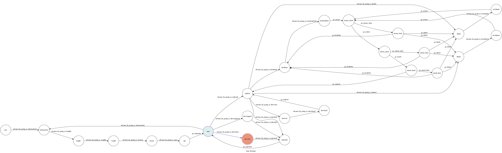

# TOC Project 2020

[](https://codeclimate.com/github/NCKU-CCS/TOC-Project-2020/maintainability)

[](https://snyk.io/test/github/NCKU-CCS/TOC-Project-2020)


Template Code for TOC Project 2020

A Line bot based on a finite state machine

More details in the [Slides](https://hackmd.io/@TTW/ToC-2019-Project#) and [FAQ](https://hackmd.io/s/B1Xw7E8kN)

## Setup

### Prerequisite
* Python 3.6
* line Page and App
* HTTPS Server

#### Install Pygraphviz(For visualizing Finite State Machine)
```sh
sudo apt-get install graphviz libgraphviz-dev pkg-config

sudo apt-get install python3.6-dev

pip3 install pygraphviz

```

* pygraphviz (For visualizing Finite State Machine)
    * [Setup pygraphviz on Ubuntu](http://www.jianshu.com/p/a3da7ecc5303)
	* [Note: macOS Install error](https://github.com/pygraphviz/pygraphviz/issues/100)


#### Secret Data
You should generate a `.env` file to set Environment Variables refer to our `.env` file`LINE_CHANNEL_SECRET` and `LINE_CHANNEL_ACCESS_TOKEN` **MUST** be set to proper values.
Otherwise, you might not be able to run your code.

#### Run Locally
You can either setup https server or using `ngrok` as a proxy.

#### a. Ngrok installation
```sh
download the ngrok by below link

unzip /path/to/ngrok.zip

./ngrok authtoken <YOUR_AUTH_TOKEN> 
```
* [ Donwload ngrok link](https://ngrok.com/download)

or you can use Homebrew (MAC)
```sh
brew cask install ngrok
```

**`ngrok` would be used in the following instruction**

```sh
ngrok http 8000
```

After that, `ngrok` would generate a https URL.

#### Run the sever

```sh
python3 app.py
```

#### b. Servo

Or You can use [servo](http://serveo.net/) to expose local servers to the internet.


## Finite State Machine


## Usage
The initial state is set to `user`.

Every time `user` state is triggered to `advance` to another state, it will `go_back` to `user` state after the bot replies corresponding message.

* user
	* Input: "go to state1"
		* Reply: "I'm entering state1"

	* Input: "go to state2"
		* Reply: "I'm entering state2"

## Deploy
Setting to deploy webhooks on AWS CLOUD server.

### Connect to AWS

1. Register AWS Educate: https://aws.amazon.com/tw/education/awseducate/

2. Create EC2 Service:
    Services > Compute > EC2

3. Launch Instance

4. Choose Ubuntu 18.04 AMI

5. Create and Download SSH key pair 

6. Use ssh login AWS server
```sh
mv ~/Downloads/MyKeyPair.pem ~/.ssh/MyKeyPair.pem

chmod 400 ~/.ssh/MyKeyPair.pem

ssh -i ~/.ssh/MyKeyPair.pem ubuntu@ip
```


### Run project on AWS CLOUD PLATFORM

1. Install the python3 environment

3. run ngrok http

	./ngrok http 8000

3. run the app.py
    python3 app.py

## Reference
[Pipenv](https://medium.com/@chihsuan/pipenv-更簡單-更快速的-python-套件管理工具-135a47e504f4) ❤️ [@chihsuan](https://github.com/chihsuan)

[TOC-Project-2019](https://github.com/winonecheng/TOC-Project-2019) ❤️ [@winonecheng](https://github.com/winonecheng)

Flask Architecture ❤️ [@Sirius207](https://github.com/Sirius207)

[Line line-bot-sdk-python](https://github.com/line/line-bot-sdk-python/tree/master/examples/flask-echo)
